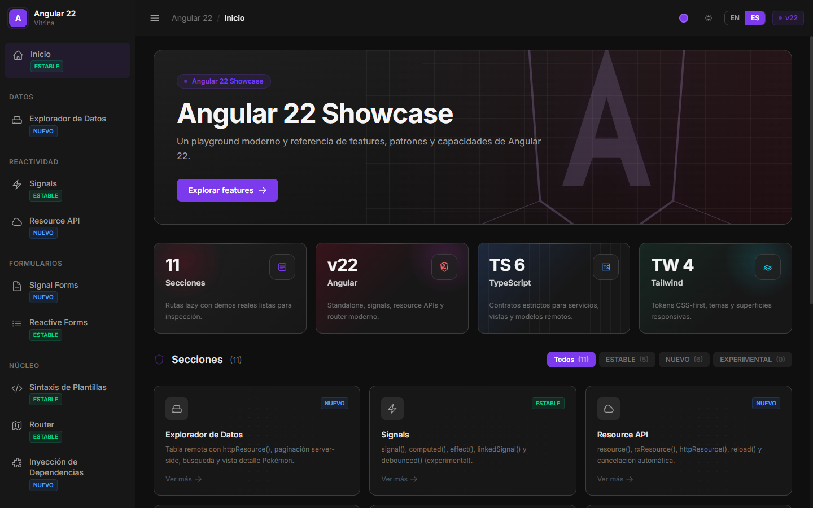
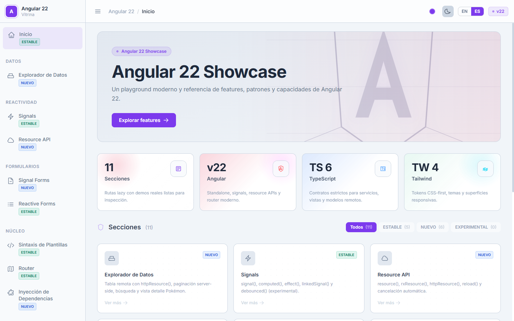
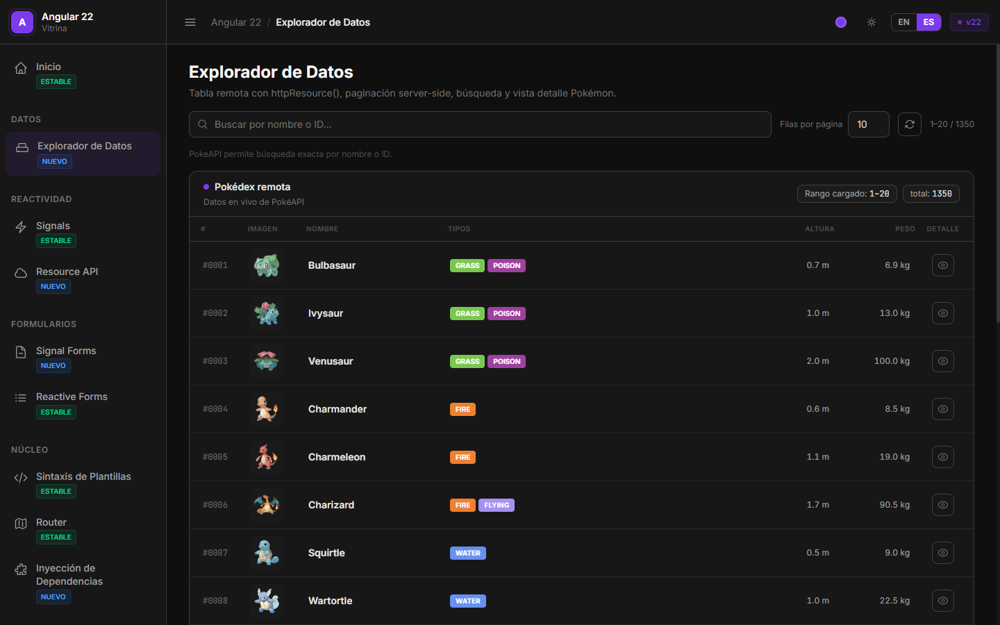
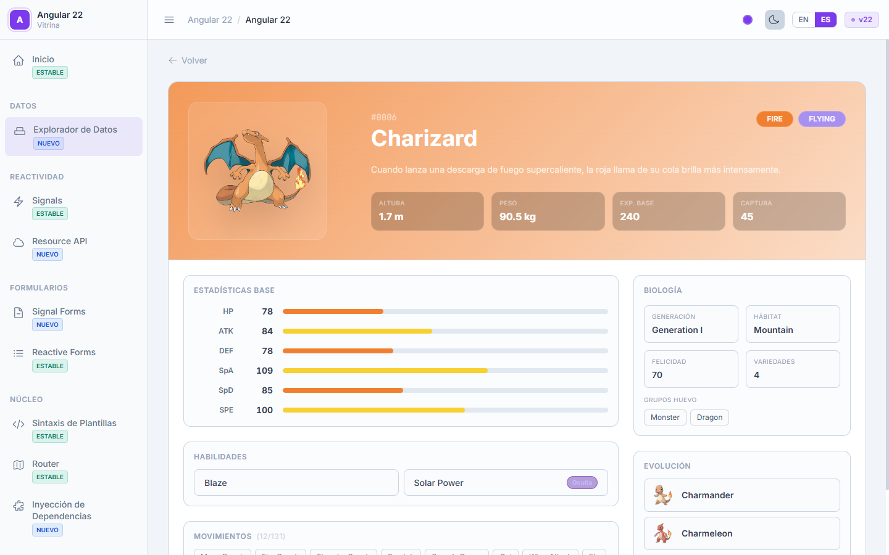

<div align="center">

[](README.md)&nbsp;&nbsp;

</div>

# Angular 22 Showcase

Aplicación interactiva de playground y referencia que cubre las principales características de **Angular 22**. Cada sección demuestra una API o patrón específico con ejemplos en vivo — primitivas de signals, Resource API, Signal Forms, accesibilidad ARIA, y más.

<p align="center">
  <a href="https://angular.dev"></a>
  <a href="https://www.typescriptlang.org"></a>
  <a href="https://tailwindcss.com"></a>
  <a href="https://nodejs.org"></a>
  <a href="https://pnpm.io"></a>
  
</p>
<p align="center">
  
  
  
</p>
<p align="center">
  <a href="https://github.com/issedgar"></a>
</p>

---

## Primeros pasos

**Requisitos previos:** Node.js ≥ 24.16.0 y pnpm ≥ 11.5.3.

```powershell
# 1. Clonar el repositorio
git clone <repo-url>
cd angular-22-app

# 2. Instalar dependencias
pnpm install

# 3. Iniciar el servidor de desarrollo
pnpm start
```

Abre `http://localhost:4200` en el navegador. La app se reconstruye automáticamente al modificar archivos.

> Si no tienes pnpm instalado: `npm install -g pnpm`  
> Si no tienes la versión correcta de Node: `nvm install 24 && nvm use 24`

---

## Capturas de pantalla

| Dashboard (oscuro) | Dashboard (claro) |
|---|---|
|  |  |

| Data Explorer | Detalle Pokémon |
|---|---|
|  |  |

---

## Stack tecnológico

| Capa | Tecnología |
|---|---|
| Framework | Angular 22 |
| Lenguaje | TypeScript 6 (strict) |
| Estilos | Tailwind CSS 4 |
| Reactividad | Angular Signals — `signal()`, `computed()`, `linkedSignal()`, `debounced()` |
| Datos asíncronos | `resource()`, `rxResource()`, `httpResource()` |
| Formularios | Signal Forms (nuevo en v22) · Reactive Forms |
| i18n | Traducciones JSON en runtime — EN / ES |
| Routing | Angular Router con rutas lazy-loaded |
| Accesibilidad | `@angular/aria` v22 |
| Testing | Vitest + jsdom |
| Gestor de paquetes | pnpm 11.5.3 |
| Node.js | ≥ 24.16.0 |

---

## Secciones

| Ruta | Sección | Descripción |
|---|---|---|
| `/` | Dashboard | Hero, estadísticas, tarjetas de features con filtro |
| `/data-explorer` | Data Explorer | Explorador PokéAPI — paginación, búsqueda, vista detalle |
| `/signals` | Signals | `signal()`, `computed()`, `effect()`, `linkedSignal()`, `debounced()` |
| `/resources` | Resource API | `resource()`, `rxResource()`, `httpResource()`, ciclo de estados |
| `/signal-forms` | Signal Forms | API de formularios Angular 22 — validadores, async, estado de envío |
| `/reactive-forms` | Reactive Forms | `FormGroup`, validación cruzada, `FormArray`, `valueChanges → toSignal()` |
| `/templates` | Template Syntax | `@if`, `@for`, `@switch`, `@defer`, `@let` |
| `/router` | Router | `RouterLink`, `withComponentInputBinding()`, guards, `toSignal(events)` |
| `/di` | Inyección de dependencias | `inject()`, `InjectionToken`, `@Injectable`, factory defaults |
| `/aria` | ARIA / Accesibilidad | `AccordionGroup`, `Tabs`, `Listbox`, live regions |
| `/components-lab` | Components Lab | Botones, Badges, Cards, sistema de Toasts, Data table |
| `/performance` | Performance | `OnPush`, `input()` + `effect()`, `track`, pure pipes |

---

## Características

- **Tema claro / oscuro** — toggle en la navbar; preferencia persistida en `localStorage`.
- **6 presets de color primario** — Angular Red, Blue, Violet, Emerald, Amber, Cyan; aplicados en runtime vía CSS custom properties.
- **i18n EN / ES** — traducciones JSON en runtime con fallback automático a inglés.
- **Completamente lazy-loaded** — cada ruta de feature es un componente standalone cargado bajo demanda.
- **57 tests unitarios** — Vitest + jsdom cubriendo signals, reactive forms y components lab.
- **WCAG AA** — HTML semántico, focus states visibles, patrones ARIA vía `@angular/aria`.

---

## Comandos

```powershell
pnpm start                              # servidor de desarrollo
pnpm build                             # build de producción → dist/
pnpm test                              # ejecutar tests Vitest

pnpm ng generate component <name>      # generar componente standalone
pnpm ng generate service <name>        # generar servicio
pnpm ng generate guard <name>          # generar guard
```

> `angular.json` contiene `"packageManager": "npm"` como artefacto de configuración de Angular CLI.  
> El lockfile del proyecto es `pnpm-lock.yaml` — usar siempre pnpm.

---

## Estructura del proyecto

```
src/
  main.ts                   # punto de entrada bootstrapApplication
  styles.css                # estilos globales — @import 'tailwindcss'
  app/
    app.ts                  # componente raíz
    app.config.ts           # ApplicationConfig, APP_INITIALIZER
    app.routes.ts           # rutas lazy de nivel superior
    core/
      i18n/                 # TranslationService, TranslatePipe, language model
      models/               # tipos de dominio compartidos
      services/             # AppearanceService, LayoutService
    features/
      dashboard/
      data-explorer/
      signals/
      signal-forms/
      reactive-forms/
      resources/
      templates/
      router-demo/
      di-patterns/
      aria-accessibility/
      components-lab/
      performance/
    layout/
      shell/                # shell con sidebar + navbar
      navbar/
      sidebar/
public/
  assets/i18n/
    en.json                 # traducciones en inglés
    es.json                 # traducciones en español
```

---

## Notas técnicas Angular 22

- `resource()` usa `params:` (no `request:`); el loader recibe `{ params, abortSignal, previous }`.
- `rxResource()` usa `stream:` (no `loader:`) para la factory Observable.
- `ResourceStatus` es un union string — `'idle' | 'loading' | 'reloading' | 'resolved' | 'error' | 'local'`.
- `debounced()` es una primitiva de signal de primera clase en Angular 22.
- `@angular/aria` v22 — `AccordionPanel` expone un signal `visible()`.
- Las variables CSS de Tailwind v4 son custom properties en runtime; los colores se pueden cambiar vía `document.documentElement.style.setProperty`.
- `[data-theme="light"]` en `styles.css` invierte la escala neutral para que las clases dark-mode funcionen en modo claro.
